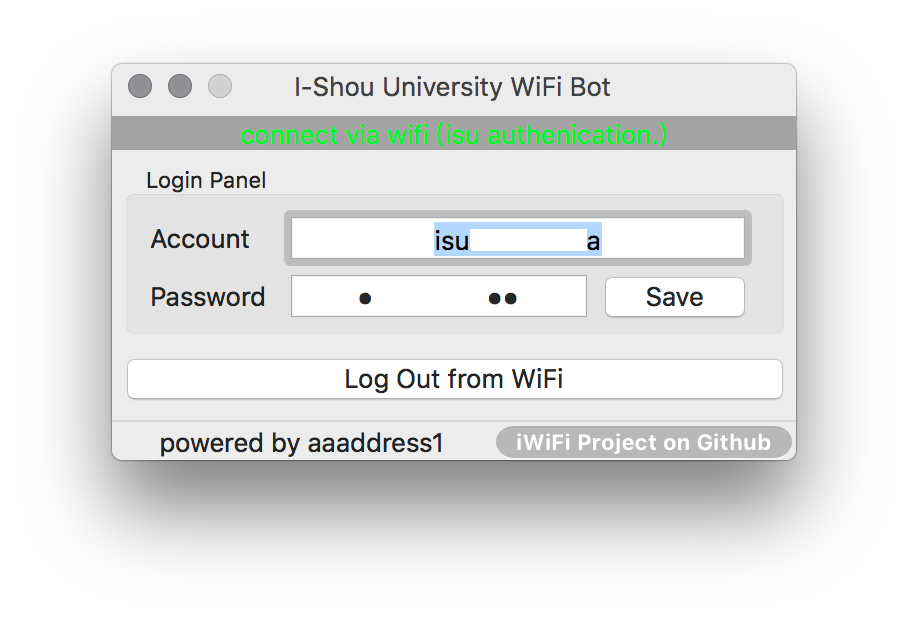
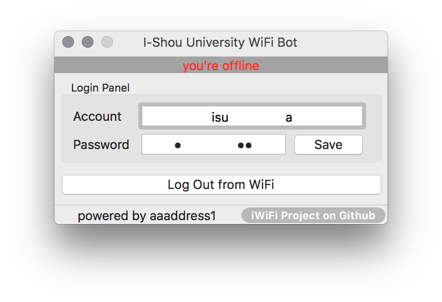
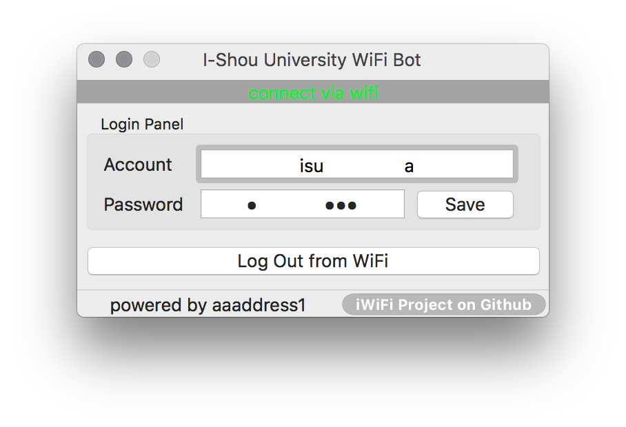

# 情境

連上 [義守大學](http://www.isu.edu.tw/pages/) 校園內設有的無線網路熱點後，所有網路連線請求都會被重設，轉至 [思科設備登入頁面](https://wism.isu.edu.tw/)（學校官方自訂頁面）必須填寫學生、學校員工或者教師帳號做登入，成功後才可正常存取非校內註冊（wism.isu.edu.tw）域名之網路流量。

此專案基於 Swift3 語言撰寫 macOS 平台應用程式，透過 [Reachability](https://github.com/tonymillion/Reachability) 專案來捕捉網路變化事件，於網路切換、重開、重連的瞬間自動檢測當前網路是否可用，並針對義守大學的思科設備登入頁面做自動化登入。針對自動化登入、分析部分採用到了第三方專案 [Alamofire](https://github.com/Alamofire/Alamofire) 來處理 HTTP 協議的 GET/POST 封包處理。

# 如何安裝
## 一般使用者
至 [下載頁面](https://github.com/aaaddress1/iWiFi/releases) 選擇對應版本號之 macosRelease.zip 文件並解壓縮取得 iWiFi.app 靜態程式文件，使用 [control] + 右鍵 點擊靜態程式文件（亦可在系統設定內信任本程式之自根簽）選擇「打開（open）」後按下確認來開啟程式。

## 開發者
若對於本程式不信任，可下載本專案原始碼自行使用 XCode 8.1 做編譯取得程式文件。

# iWiFi for macOS

當程式感測到網路狀態變化時自動針對義守大學熱點之思科設備自動做登入並綠字顯示自動化登入完成。

程式感測到在離線狀態下會切換紅字提示無可用連線之網路。

程式感測到正在無線熱點連線下並且網路暢通即綠字提示網路可用。

# 提問與幫助
任何疑問或者需求可來信自 aaaddress1@gmail.com 或者針對這份開源專案發新的 Issue 即可。